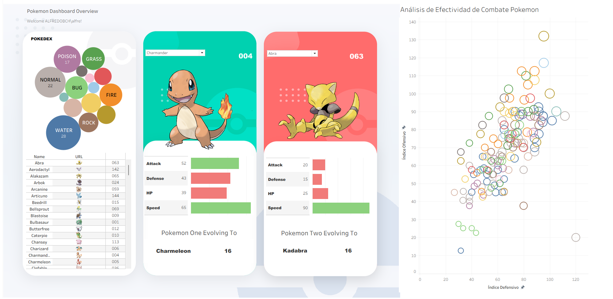
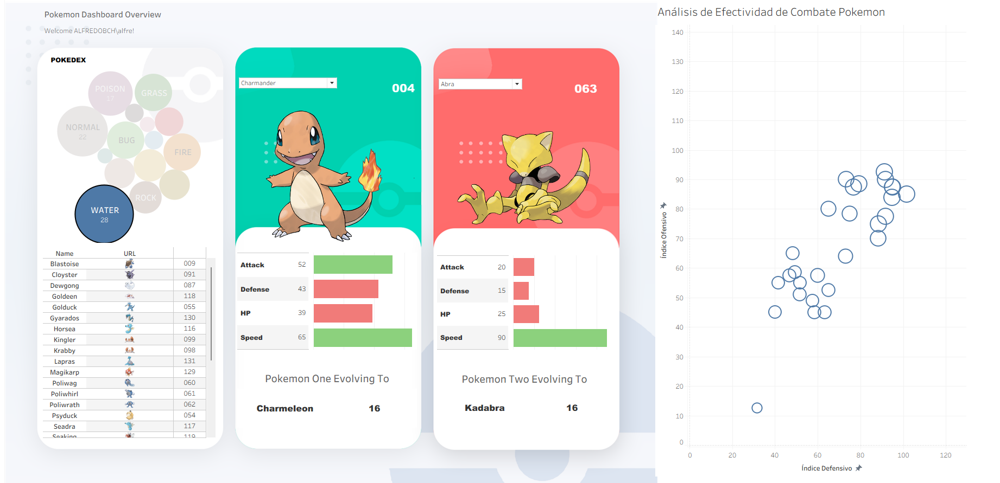
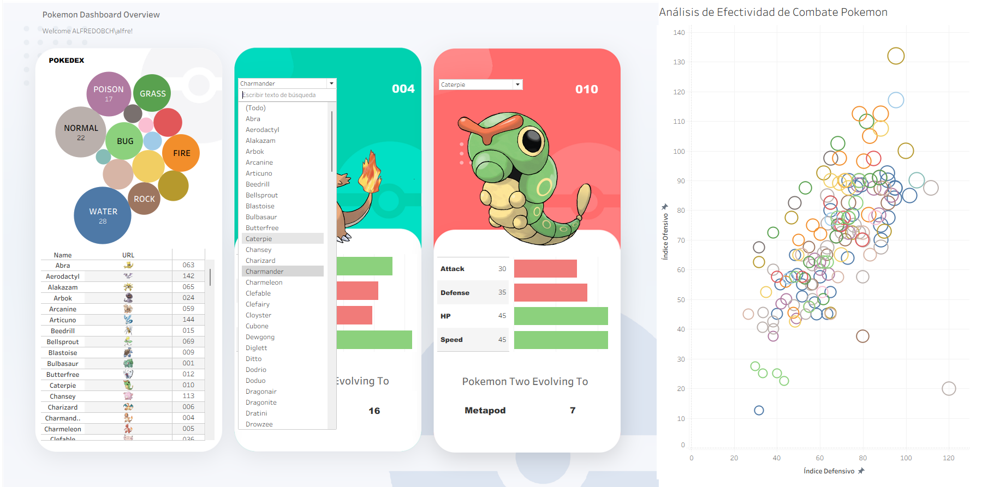
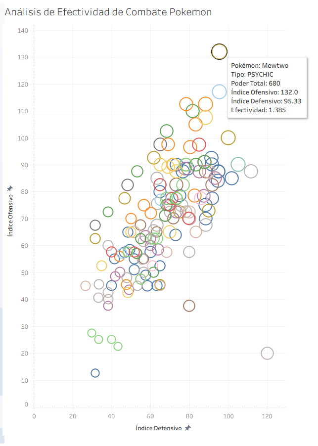

# 📊 Pokémon Tableau Dashboard - Análisis Interactivo de Datos

## 🎯 Descripción del Proyecto
Dashboard interactivo desarrollado en **Tableau Public** que analiza datos de Pokémon de la primera generación, enfocado en visualización de datos y análisis de efectividad de combate.

### 🔗 [Ver Dashboard en Tableau Public](https://public.tableau.com/views/PokemonDashboard-InteractiveDataAnalysis/Pokemon_Dashboard_Overview?:language=es-ES&:sid=&:redirect=auth&:display_count=n&:origin=viz_share_link)

## 📈 Funcionalidades Principales

### **Pokemon Dashboard Overview**
- **Visualización de tipos**: Gráfico de burbujas interactivo mostrando distribución por tipos.
- **Lista dinámica**: Pokédex completo de la primer generación con filtros en tiempo real.
- **Tarjetas de stats**: Comparación visual entre dos Pokémon seleccionados.
- **Imágenes dinámicas**: Integración de sprites oficiales vía URL.
- **Filtros interactivos**: Por tipo y nombre de Pokémon.




  

### **Análisis de Efectividad de Combate**
- **Diagrama de dispersión**: Relación Índice Ofensivo vs Defensivo
- **Métricas calculadas personalizadas**:
  - `Total Battle Score`: Suma de todas las estadísticas
  - `Offensive Index`: Promedio de ataques (físico + especial)
  - `Defensive Index`: Promedio ponderado de defensas + HP
  - `Battle Effectiveness`: Ratio ofensivo/defensivo
- **Codificación visual**: Tamaño por poder total, color por tipo
- **Tooltip interactivo**: Información detallada al hover
### ¿Por qué estas métricas?
1. Total Battle Score: Representa el "poder general" del Pokémon.  
Suma todas las stats → Pokémon más completos tienen scores altos

2. Offensive Index: Capacidad de hacer daño.  
Promedio de ataques → Mide potencial ofensivo real

3. Defensive Index: Capacidad de resistir daño.  
(Defense + Sp.Defense + HP) / 3 → HP cuenta igual que defensas porque son puntos de vida

4. Battle Effectiveness: ¿Qué tan "roto" está el Pokémon?.  
Ofensivo/Defensivo → Ratios altos = glass cannons, ratios bajos = tanques

5. Type Ranking: Jerarquía competitiva.  
Dragon/Psychic dominaban Gen 1 → Fire era top tier → Resto normal


## 🛠️ Habilidades Técnicas Aplicadas

### **Tableau Public**
- Carga de datos desde dataset de Excel (.xlsx)
- Conversión de tipos de datos (String → Integer, Discreto → Continuo)
- Creación de campos calculados
- Integración de imágenes externas vía URL
- Filtros dinámicos y acciones de dashboard

### **Análisis de Datos**
- Análisis estadístico exploratorio
- Visualización de patrones y correlaciones

## 📊 Métricas y Fórmulas Implementadas

```sql
-- Total Battle Score
[HP] + [Attack] + [Defense] + [Speed] + [Special Attack] + [Special Defense]

-- Offensive Index  
([Attack] + [Special Attack]) / 2

-- Defensive Index
([Defense] + [Special Defense] + [HP]) / 3

-- Battle Effectiveness
[Offensive Index] / [Defensive Index]

-- Type Ranking
IF [Type] = "DRAGON" THEN 1 
ELSEIF [Type] = "PSYCHIC" THEN 2 
ELSEIF [Type] = "FIRE" THEN 3 
ELSE 4 END
```
## 🎮 Datos Utilizados

- Fuente: Dataset oficial de Pokémon Gen 1 (151 especies) de tableau public
- Variables: HP, Attack, Defense, Speed, Special Attack, Special Defense, Type, Evolution
- Imágenes: Sprites oficiales integrados vía URL

## 🚀 Cómo Usar el Dashboard

1. Explorar tipos: Clic en burbujas de tipos para filtrar
2. Comparar Pokémon: Seleccionar nombres en dropdown para tarjetas
3. Análisis avanzado: Usar segunda hoja para insights de combate
4. Interactividad: Todos los filtros están conectados entre visualizaciones

## 📝 Créditos y Aprendizaje

Inspiración base: [Proyecto Base de BRAVO CODE, un crack!](https://www.youtube.com/watch?v=8YrsJO_XAI8) - Estructura inicial de tarjetas y filtros
Implementación propia: Análisis de Efectividad de Combate y métricas.
Objetivo: Proyecto práctico básico de Data Analyst y Tableau.
